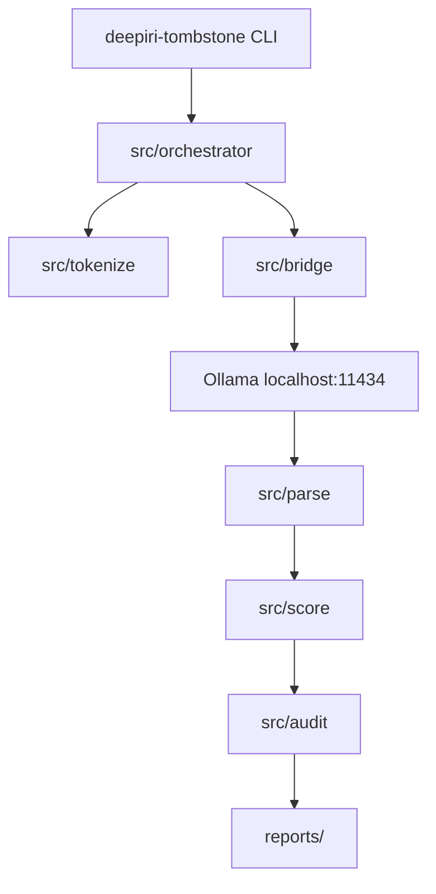

# Architecture

## Pipeline

## Why the bridge is separate

[blang libb](https://github.com/sergev/blang) is freestanding. HTTP and shared buffers live in `src/bridge/`.

## Reports

| File | Stage |
|------|-------|
| `reports/audit.ledger` | audit |
| `reports/stats.dat` | score |
| `reports/summary.txt` | score |
