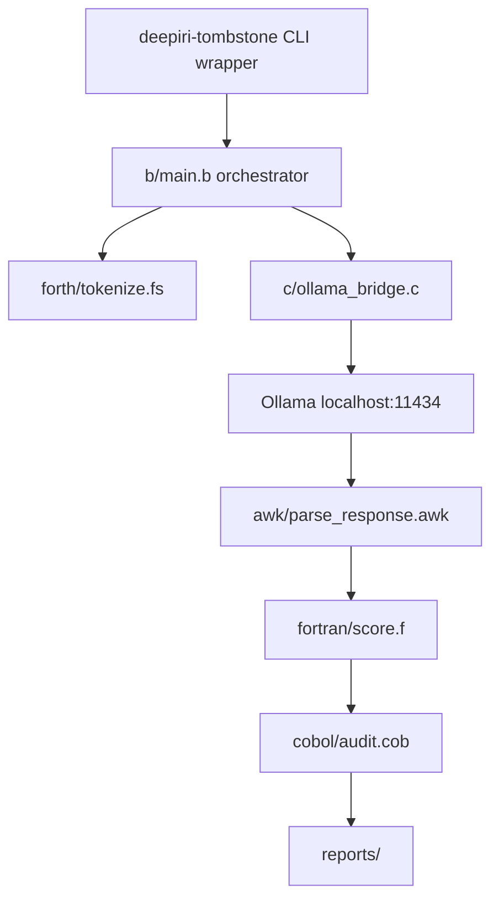

# Architecture

## Pipeline

## Why B needs a C bridge

[blang libb](https://github.com/sergev/blang) is freestanding — `read`, `write`, `printf` only. HTTP and `system()` live in `libdeepiri_tombstone.a`.

## Reports

| File | Producer |
|------|----------|
| `reports/audit.ledger` | COBOL |
| `reports/stats.dat` | Fortran |
| `reports/summary.txt` | Fortran |
